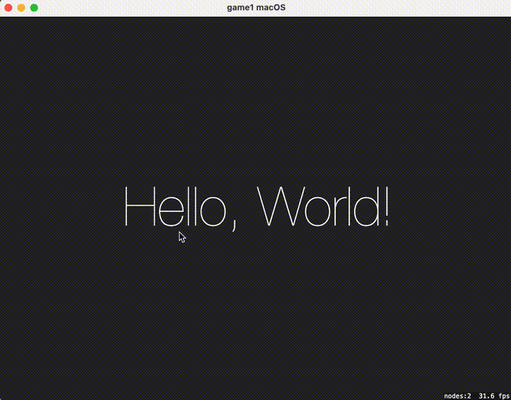
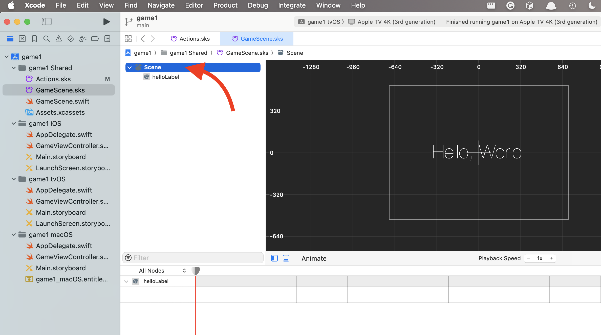

# Apple Game Development: Multi-Platform 2D Game Development with SpriteKit

## Demo

|                 |                          iOS                           |                           tvOS                           |                           macOS                            |
|:---------------:|:------------------------------------------------------:|:--------------------------------------------------------:|:----------------------------------------------------------:|
| Infinite Scroll |  |  |  |

## Project Structure

| Root                             | level 2                        | level 3                    | description                                                                 |
|----------------------------------|--------------------------------|----------------------------|-----------------------------------------------------------------------------|
| `<<Project Name>>.xcodeproj`     |                                |                            |                                                                             |
|                                  | Project                        |                            |                                                                             |
|                                  |                                | Info                       | General project information                                                 |
|                                  |                                | Build Settings             | Compiling and performance optimization settings                             |
|                                  |                                | Package Dependencies       | External libraries and packages                                             |
|                                  | ------------------------------ | -------------------------- | --------------------------------------------------------------------------- |
|                                  | Targets                        |                            |                                                                             |
|                                  |                                | General                    | Basic setup like app icons and deployment target                            |
|                                  |                                | Signing & Capabilities     | Code signing and app capabilities                                           |
|                                  |                                | Resource Tags              | Tags for resource optimization                                              |
|                                  |                                | Info                       | Target-specific information                                                 |
|                                  |                                | Build Settings             | Platform-specific build settings                                            |
|                                  |                                | Build Phases               | Order of operations for app build                                           |
|                                  |                                | Build Rules                | Custom rules for file processing                                            |
| -------------------------------- | ------------------------------ | -------------------------- | --------------------------------------------------------------------------- |
| Shared                           |                                |                            |                                                                             |
|                                  | `actions.sks`                  |                            | SpriteKit file for defining animations and actions visually                 |
|                                  | `game scene.sks`               |                            | Scene layout in SpriteKit's visual editor for game elements                 |
|                                  | `game scene.swift`             |                            | Logic and interactions for the scene, correlating with `game scene.sks`     |
|                                  | `assets.xcassets`              |                            | Asset catalog for images, animations, and media resources                   |
| -------------------------------- | ------------------------------ | -------------------------- | --------------------------------------------------------------------------- |
| iOS                              |                                |                            |                                                                             |
|                                  | `AppDelegate.swift`            |                            | Manages application lifecycle events                                        |
|                                  | `GameViewController.swift`     |                            | Controls the game's main view and user interactions                         |
|                                  | `Main.storyboard`              |                            | User interface layout                                                       |
|                                  | `LaunchScreen.storyboard`      |                            | App's launch screen appearance                                              |
| -------------------------------- | ------------------------------ | -------------------------- | --------------------------------------------------------------------------- |
| tvOS                             |                                |                            |                                                                             |
|                                  | Similar contents to iOS        |                            |                                                                             |
| -------------------------------- | ------------------------------ | -------------------------- | --------------------------------------------------------------------------- |
| macOS                            |                                |                            |                                                                             |
|                                  | `Game1_macOS.entitlements`     |                            | App capabilities for macOS                                                  |

## Deep Dive

- **Shared**
    - `actions.sks`: *SpriteKit* file (*`.sks`*) for visually defining *actions* for *nodes* in the *scene*.
        - Definitions:
            - [**SpriteKit**][SpriteKit]
                - **Definition**: Graphics rendering and animation framework 
                - **Purpose**: 
                    - Add high-performance interactive 2D content with smooth animations to apps.
                    - Create games with a high-level set of 2D game-based tools.
                - **Details**:
                    - **Overview**
                        - General-purpose framework for drawing shapes, particles, text, images, and video in two dimensions.
                        - Leverages Metal to achieve high-performance rendering.
                        - Offers simple programming for game and graphics-intensive apps development.
                        - Uses rich set of animations and physics behaviors to add life to visual elements and gracefully transition between screens.
                        - Supported in iOS, macOS, tvOS, and watchOS.
                        - Integrates well with frameworks such as GameplayKit and SceneKit.
                        - Can be used in a compatible iPhone or iPad app running in visionOS, but not in apps created specifically for visionOS.
                        - Note: Don't use it in apps you create specifically for visionOS.
                    - **Key Features and aspects**
                        - **Node-Based Architecture**: 
                            - SpriteKit uses a *node*-based hierarchical structure
                                - Each *Node* represents game's visual element (e.g., characters, landscapes, or interactive elements).
                                - This structure makes it easy to organize and manipulate game components.
                        - **Physics Engine**: 
                            - SpriteKit includes a *physics engine* that allows adding realistic physics behaviors to game elements.
                            - This feature facilitates the simulation of natural forces, collisions, and other physical properties.
                        - **Animation and Actions**: 
                            - SpriteKit provides a robust system for animating nodes.
                            - This allows creating complex animations using sequences of *actions*, which can include moving, scaling, rotating, or fading elements.
                        - **Particle Systems**: 
                            - SpriteKit supports *particle systems* for creating special effects like fire, smoke, or explosions.
                            - These can enhance the visual appeal of games with dynamic and eye-catching effects.
                        - **Ease of Integration**: 
                            - SpriteKit integrates well with other Apple frameworks, such as GameplayKit for advanced game behaviors and Game Center for incorporating multiplayer features and tracking achievements.
                        - **Performance Optimization**: 
                            - SpriteKit is optimized for performance, ensuring smooth frame rates and responsive gameplay experiences.
                            - It allows efficient use of graphics resources and CPU.
                        - **SwiftUI and UIKit Integration**: 
                            - SpriteKit can be integrated with SwiftUI and UIKit, providing flexibility for developers to create interfaces using these modern UI frameworks while leveraging SpriteKit for the game's graphical content.
                            - Note: SpriteKit is not supported in SwiftUI previews.
                        - **Development Tools**: 
                            - SpriteKit works seamlessly with Xcode, providing tools like scene editors and profiling instruments that make game development more efficient.
                - In summary, SpriteKit is a comprehensive toolkit for 2D game development on Apple platforms, offering a range of features from basic rendering and animation to advanced physics and integration capabilities.
            - *Scene* aka [*SKScene*][SKScene] (short for *SpriteKit Scene*)
            - 
                - **Definition**: An object that organizes all of the active SpriteKit content.
                - **Purpose**: 
                    - A scene is the root node in a tree of SpriteKit nodes (e.g., sprites, shapes, and particle systems).
                    - It provides a way to organize the nodes in a tree and present them for display in a view.
                    - It also provides a way to update the nodes in the tree each frame.
                - **Details**:
                    - **Overview**
<!-- 
                        - A scene is an instance of the SKScene class.
                        - It is the root node in a tree of SpriteKit nodes.
                        - It provides a way to organize the nodes in a tree and present them for display in a view.
                        - It also provides a way to update the nodes in the tree each frame.
                        - A scene is a container for the contents of a scene graph.
                        - A scene graph is a tree of nodes that represent the contents of a scene.
                        - Each node in the tree is an instance of the SKNode class or one of its subclasses.
                        - The scene graph is organized in a hierarchical manner, with the scene at the root of the tree.
                        - The scene graph is traversed each frame and each node is rendered in turn.
                        - The scene graph is also traversed each frame and each node is updated in turn.
                        - The scene graph is traversed each frame and each node is updated in turn.
                        - The scene graph is also traversed each frame and each node is updated in turn.
        - `Actions.sks`'s boilerplate components:
            - 
            - Actions
                - Pulse: It is a *sequence* of *actions*.
                    - Sequence:
                        - ...
 -->

TODO:

- **Shared**
    - `actions.sks`: *SpriteKit* file (*`.sks`*) for visually defining *actions* for *nodes* in the *scene*.
    - `game scene.sks`: Scene layout in SpriteKit's visual editor for game elements.
    - `game scene.swift`: Logic and interactions for the scene, correlating with `game scene.sks`.
    - `assets.xcassets`: Asset catalog for images, animations, and media resources.
- **iOS**
    - `AppDelegate.swift`: Manages application lifecycle events.
    - `GameViewController.swift`: Controls the game's main view and user interactions.
    - `Main.storyboard`: User interface layout.
    - `LaunchScreen.storyboard`: App's launch screen appearance.
- **tvOS**
    - Similar contents to iOS folder.
- **macOS**
    - Similar to iOS folder with `Game1_macOS.entitlements` for app capabilities.
    - `Game1_macOS.entitlements`: App capabilities for macOS.

---

<!-- References -->

[SpriteKit]: https://developer.apple.com/documentation/spritekit/
[SKScene]: https://developer.apple.com/documentation/spritekit/skscene